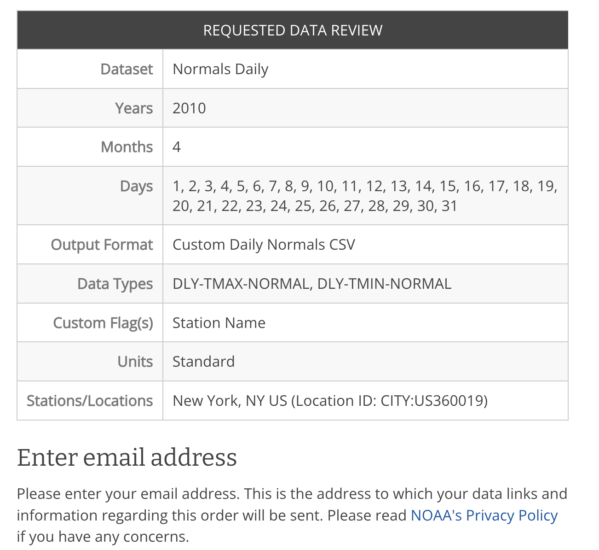

```{r load-packages, message=FALSE, echo=FALSE}
library(tidyverse)
library(readr)
library(data.table)
library(ggplot2)
library(dplyr)
library(janitor)
library(lubridate)
library(zoo)
```

## Introduction
::: {style="font-size: 70%;"}
- Weather data from NOAA Climate Data Online database
  - Daily max and min temps from Central Park in 2010
- Calculate year to date average and six day moving average
:::
```{r}
#| echo: false
#| out-width: "40%"
#| fig-align: "center"

```

## Data Import
- Subset on the web portal so less data tidying

```{r import-data, echo=FALSE}
# Import and tidy
url <- "https://raw.githubusercontent.com/jocslater-code/DATA607/refs/heads/main/Week3B/NOAA_temp_data.csv"
raw_noaa_df <- read_csv(url, show_col_types = FALSE)
raw_noaa_df<- clean_names(raw_noaa_df)
```

```{r, echo=TRUE}
glimpse(raw_noaa_df)
```

```{r, echo=FALSE}
noaa_df<- select(raw_noaa_df, date, dly_tmax_normal, dly_tmin_normal)
noaa_df <- noaa_df %>% rename(temp_max = dly_tmax_normal)
noaa_df <- noaa_df %>% rename(temp_min = dly_tmin_normal)

```

## Data Tidying and Formating
- After formatting the date strings for analysis using the liquidate and zoo libraries
```{r, echo=TRUE}
# Reformat date column for easy handling and make sure things are in proper order
noaa_df <- noaa_df %>%
  mutate(date = dmy(paste0(date, "-2010"))) %>%
  arrange(date)
glimpse(noaa_df)
```

## Window Functions
- Used dplyr library
  - Cumulative mean (year to date average) 
  - Rolling mean (moving average) 
```{r, echo=TRUE}
noaa_df <- noaa_df %>%
  # Calculate cumulative averages
  mutate(
    ytd_avg_min = cummean(temp_min),
    ytd_avg_max = cummean(temp_max)
  ) %>%
  # Calculate 6-day moving averages
  mutate(
    mavg_6day_min = rollmean(temp_min, k = 6, fill = NA, align = "right"),
    mavg_6day_max = rollmean(temp_max, k = 6, fill = NA, align = "right")
  )
```

## Results - Moving Average
::: {style="font-size: 70%;"}
NOTE: Short gap in data at the beginning of the year for the rolling average - six day moving average
:::
```{r plot-mavg}
ggplot(noaa_df, aes(x = date)) +
  # Unprocessed Data
  geom_line(aes(y = temp_max, color = "Max Temp (Unprocessed)"), linetype = "dotted", linewidth = 0.8) +
  geom_line(aes(y = temp_min, color = "Min Temp (Unprocessed)"), linetype = "dotted", linewidth = 0.8) +
  
  # 6 Day Moving Average
  geom_line(aes(y = mavg_6day_max, color = "Max Temp (6-day MAvg)"), linetype = "solid", linewidth = 1.1) +
  geom_line(aes(y = mavg_6day_min, color = "Min Temp (6-day MAvg)"), linetype = "solid", linewidth = 1.1) +
  
  # Colors
  scale_color_manual(
    values = c(
      "Max Temp (Unprocessed)"      = "firebrick1",
      "Max Temp (6-day MAvg)" = "firebrick4",
      "Min Temp (Unprocessed)"      = "lightblue3",
      "Min Temp (6-day MAvg)" = "midnightblue"
    ),
    breaks = c("Max Temp (Unproce.)", "Max Temp (6-day MAvg)", "Min Temp (Unproc.)", "Min Temp (6-day MAvg)")
  ) +
  
  # Labeling
  labs(
    title = "Daily Temperatures, NYC 2010",
    subtitle = "Dotted = Unprocessed | Solid = 6-Day Moving Average",
    x = "Date",
    y = "Temperature (F)",
    color = "Series"
  ) +
  scale_x_date(date_labels = "%b", date_breaks = "1 month") +
  theme_minimal() +
  theme(
    legend.position = "bottom"
  )

```

## Results - Year to Date
```{r}
ggplot(noaa_df, aes(x = date)) +
  geom_line(aes(y = ytd_avg_max, color = "Max Temp (YTD Avg)"), linetype = "solid", linewidth = 0.9) +
  geom_line(aes(y = ytd_avg_min, color = "Min Temp (YTD Avg)"), linetype = "solid", linewidth = 0.9) +
  
  # Colors
  scale_color_manual(
    values = c(
      "Max Temp (YTD Avg)"  = "coral2",
      "Min Temp (YTD Avg)"  = "steelblue2"
    ),
    breaks = c(
      "Max Temp (YTD Avg)", "Min Temp (YTD Avg)")
  ) +
  
  # Labels
  labs(
    title = "YTD Average Temperatures, NYC 2010",
    x = "Date",
    y = "Temperature (F)",
    color = "Series"
  ) +
  scale_x_date(date_labels = "%b", date_breaks = "1 month") +
  theme_minimal() +
  theme(
    legend.position = "bottom",
    legend.box = "horizontal",
    panel.grid.minor = element_blank()
  ) +
  guides(color = guide_legend(ncol = 2))

```


## Summary and Next Steps
- Pivoted from IMF currency exchange rate data
- "Ordered" NOAA data
- Moving average - smoothing already smooth data
- Expected behavior for curve trends.

Next Steps

- Include precipitation, wind speed, etc and analyze relationships
